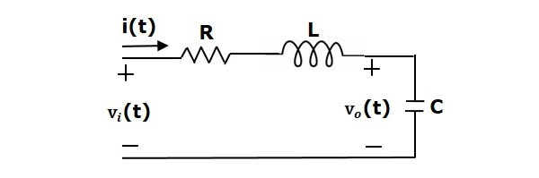

Afin d’étudier le fonctionnement de l’asservissement à l’aide de calculs de convolution.

[Lien](https://www.tutorialspoint.com/control_systems/control_systems_quick_guide.htm)


```python
# Import les bibliothèques nécessaires

import numpy as np
import matplotlib.pyplot as plt


```



source : tutorialspoint.com 


```python
# Les variables de la simulation

# Le temps de simulation

time = np.linspace(0, 0.01, 1000)  # 10 ms de simulation

# V_in = entrée de la tension
# V_out = sortie de la tension
# i_in = entrée du courant

# Les composantes du circuit

R = 1000  # Résistance R en ohms
L = 1e-3  # Inductance L en henrys
C = 1e-6  # Capacité C en farads

# On prend la tension de la capacité comme la sortie du circuit

V_in = 3 * time # Tension d'entrée en volts
i_in = 0.01 * time # Courant d'entrée en ampères
```

Pour la capacité


```python
def Tension_capacite(time, C, i_in):
    return 1/C * np.cumsum(i_in * np.diff(time, prepend=0))

plt.figure(figsize=(10, 5))
plt.plot(time, Tension_capacite(), label='Tension sur le condensateur', color='blue')

```
