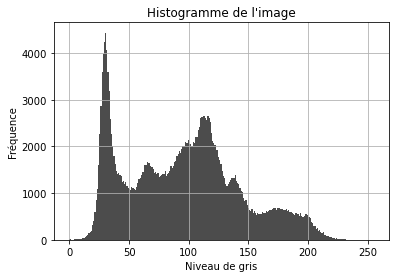

Fast Efficient & Lossless Image Compression System 

### L'Image


```python
# Chargement des bibliothèques

import numpy as np
from PIL import Image
import matplotlib.pyplot as plt

# Chargement de l'image

image_path = 'Lenna.png'
image = Image.open(image_path)
image = image.convert('L')  # Convertir l'image en niveaux de gris
image_array = np.array(image)
plt.imshow(image_array, cmap='gray')
plt.title('Image originale')
plt.axis('off')


```


    (-0.5, 511.5, 511.5, -0.5)


    

    


### Histogramme


```python
# Affichage de l'histogramme

plt.figure()
plt.hist(image_array.flatten(), bins=256, range=(0, 255), color='black', alpha=0.7)
plt.title('Histogramme de l\'image')
plt.xlabel('Niveau de gris')
plt.ylabel('Fréquence')
plt.grid()
plt.show()
```


    

    


## Les informations de l'imamge

L'entropie : 

$$ Entropy = \sum_{k=0}^{255} p_k \log_2(p_k)$$


```python
def Entropy(matrice):
    # Calcul de l'entropie d'une matrice
    hist, _ = np.histogram(matrice.flatten(), bins=256, range=(0, 255), density=True)
    hist = hist[hist > 0]
    entropie = -np.sum(hist * np.log2(hist))
    return entropie

print("Entropie de l'image originale :", Entropy(image_array))
```

    Entropie de l'image originale : 7.415894872349124

