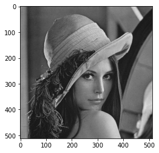

#### Compression sans perte FELIC  


```python
# Chargement des bibliothèques

import numpy as np
from PIL import Image
import matplotlib.pyplot as plt

# Chargement de l'image

image_path = 'Lenna.png'
image = Image.open(image_path)
image = image.convert('L')  # Convertir l'image en niveaux de gris
image_array = np.array(image)
plt.imshow(image_array, cmap='gray')

```


    <matplotlib.image.AxesImage at 0x7e8185abaee0>


    

    


## Les informations de l'imamge


```python


```

    [[137 137 138 ...  96  94  93]
     [137 137 137 ...  94  96  99]
     [137 137 137 ...  95  98  99]
     ...
     [107 109 115 ...  40  39  42]
     [111 111 116 ...  40  41  44]
     [102 102 110 ...  41  43  47]]


    

    

