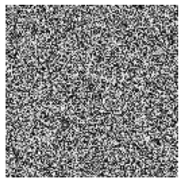

### Génération Images (chose intéréssante)

[utils.py](./utils.py)


```python
# Les librairies

import os
import numpy as np
import matplotlib.pyplot as plt


# Les Variables

h = 128
w = 128
```


```python
def generate_image():


    # Create a random image
    image = np.random.rand(h, w)

    return image

```


    

    


```python
kernel = np.array([[1, 0, -1],
                   [1, 0, -1],
                   [1, 0, -1]])

def apply_filter(image, kernel):
    """
    Apply a filter to an image using convolution
    """
    from scipy.ndimage import convolve

    # Convolve the image with the kernel
    filtered_image = convolve(image, kernel)

    return filtered_image


```
