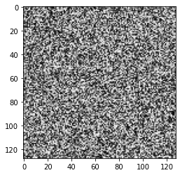

### Génération Images (chose intéréssante)

[utils.py](./utils.py)
[test.cpp](./test.cpp)


```python
# Les librairies

import os
import numpy as np
import matplotlib.pyplot as plt
from scipy.ndimage import convolve

# Les Variables

h = 128
w = 128
```


```python
def generate_image():
    image = np.random.rand(h, w)
    return image

```


```python

```


```python

```


    <matplotlib.image.AxesImage at 0x70cc452551f0>


    

    

